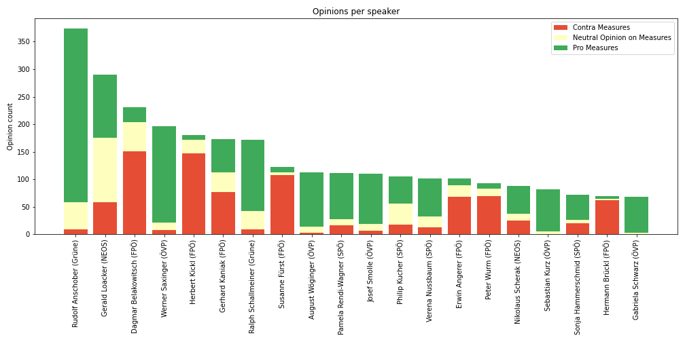
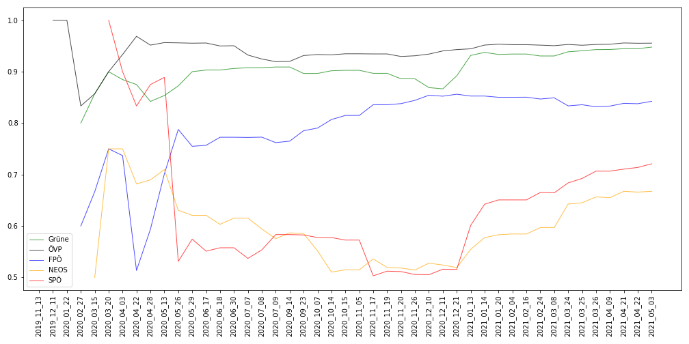

# Political Opinion Slalom

Text classification and visualization of opinions extracted from Austrian political speeches.

The following approaches were used to predict opinions: Embeddingbag, LSTM, BERT, Google Open AI, Multinomial Bayes, BM25, Logistic Regression, Rule-baseed with Spacy library.

## Project Structure
| Folder                     | Description                                                                            |
|----------------------------|----------------------------------------------------------------------------------------|
| `graphing/`                | Visualizing opinion distributions and consistencies. Plot data set stats.              |
| `helper/`                  | Helpers for processing results and data sets.                                          |
| `labeling_software/`       | Makes the labeling of a data set easier.                                               |
| `lexica/`                  | Word polarity lists.                                                                   |
| `models/first_experiment/` | Contains model implementations to classify opinions.                                   |
| `other/`                   | Contains third-party libraries and tutorial implementations.                           |
| `parser/`                  | Contains parsers for converting parliament speech protocols between different formats. |
| `results/`                 | Where model evaluations and plots are stored.                                          |

## A walk-through

Here is a walk-through of what was done. It may be necessary to adapt some paths in the code files.

1. Downloaded _.html_ speech protocols from [Parlament Republik Österreich](https://www.parlament.gv.at/PAKT/STPROT/) into `protocols/periode27utf8`. Store tentative (vorläufige) protocols into `protocols/vorlaufige`.
2. Use `parsers/` to parse the downloaded protocols into the _primary_, _secondary_ and _tertiary formats_ (located in `protocols/primary_format`, `protocols/secondary_format`, and `protocols/tertiary_format`).
3. Optional: Use `helper/no_president.py` to filter out the president's speeches.
4. Use `secntence_filter.py` to create a data set of interest. The `massnahmen()` function extracts sentences related to preventative measures against the Coronavirus.
5. Run `labeling_software/main.py` to start the labeling software. In the code, provide paths to the unlabeled and the labeled data set. Then, label the data set by pressing arrow keys. Left=negative, Down=Indifferent, Right=Positive, Up=Irrelevant (remove from data set). When pressing the Down-Key one time, the sentence context is loaded. Upon pressing the Down-Key a second time, the sample is labeled as _Indifferent_. 
6. Create data set analysis with `graphing/stats.ipynb`, `graphing/stats.py`, and `graphing/speech_lengths.ipynb`.
7. After the labeled data set is created, run it through some classification models from the `models/` folder. Models from `models/second_experiment` will save the classificaion reports into the `results/` folder. The _Bert_ models should be run on GPU or TPU (Google Collab servers were an option at the time).
8. Create performance graphs with `graphing/performance_distribution.ipynb`.
9. Use `models/second_experiment/massnahmen_bert_02_store_predictions.ipynb` to create predictions for the entire data set. Then use `helper/concat_bert_results.ipynb` to concatenate the predictions. Evaluate prediction performance with `graphing/prediction_performance`.
10. Create a list of speaker names and store it to `helper/speaker_names.txt`. Then use `unify_speakers.ipynb` to append a column of unified speaker names to the data set.
11. Plot visualizations of actual and predicted opinion data with `graphing/opinion_consistency.ipynb`. Also, use it to plot the consistency of opinions per party and speaker over time.
12. Plot the difference between actual and predicted opinion consistency over time with `graphing/opinion_consistency_comparison.ipynb`.
13. Determine the minimum required model accuracy for predicting opinion consistency within a desired margin of error with `graphing/confidence_intervals.ipynb`.

## Example Graphs

Visualization of opinions on the topic of preventative measures against the Coronavirus: 

Visualization of opinion consistency over time on the topic of preventative measures against the Coronavirus: 
